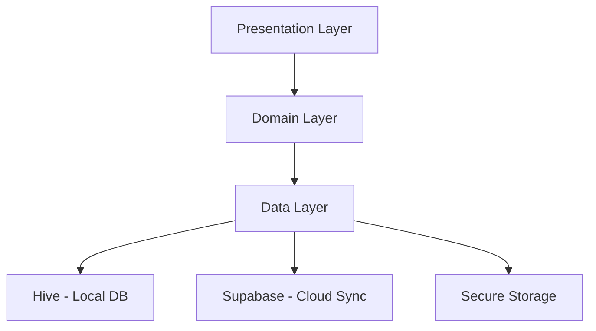

# 🔐 ZeroPass - Secure Password Manager

<div align="center">


**A modern, cross-platform password manager built with Flutter that prioritizes privacy, security, and user experience.**

[](https://flutter.dev)
[](https://dart.dev)
[](LICENSE)

</div>

---

## 📖 Table of Contents

- [Overview](#-overview)
- [Features](#-features)
- [Architecture](#-architecture)
- [Security Implementation](#-security-implementation)
- [TOTP Implementation](#-totp-implementation)
- [Tech Stack](#-tech-stack)
- [Project Structure](#-project-structure)
- [Getting Started](#-getting-started)
- [Development](#-development)
- [Security Considerations](#-security-considerations)
- [License](#-license)
- [Support](#-support)

---

## 🌟 Overview

ZeroPass is a secure, cross-platform password manager built using Flutter. It prioritizes user privacy and data protection through AES-256 encryption and a zero-knowledge architecture. Designed for usability and accessibility, ZeroPass works seamlessly across mobile, desktop, and web platforms.

### Key Highlights

- Zero-knowledge architecture: Your master password is never transmitted or stored.
- AES-256 encryption for all sensitive data.
- Offline-first with optional Supabase cloud sync.
- Built-in TOTP generator with QR code support.
- Clean Material Design 3 UI.

---

## ✨ Features

### Password Management
- Encrypted local storage using Hive.
- Customizable password generator.
- Category-based organization and search.
- One-tap copy to clipboard.

### TOTP (Two-Factor Authenticator)
- Scan QR codes or add secrets manually.
- Real-time 6-digit code generation.
- Encrypted storage of secrets.
- Full RFC 6238 compatibility.

### Security
- PBKDF2 key derivation with SHA-256 and 100k iterations.
- Secure clipboard auto-clear.
- Optional biometric lock and session timeout.
- All network communication secured via HTTPS.

### Cross-Platform Sync (Optional)
- Encrypted backup and sync using Supabase.
- Conflict-aware multi-device support.

---

## 🏗️ Architecture

ZeroPass is structured using a layered clean architecture:



---

## 🛡️ Security Implementation

### Key Derivation and Encryption

```dart
final pbkdf2 = PBKDF2KeyDerivator(HMac(SHA256Digest(), 64))
  ..init(Pbkdf2Parameters(salt, 100000, 32));
```

- AES-256 in CBC mode with unique IVs.
- Salted key derivation using PBKDF2.
- Secure storage via flutter_secure_storage.

---

## 🔢 TOTP Implementation

- Follows RFC 6238 with 6-digit HMAC-SHA1 codes.
- Generates codes locally every 30 seconds.
- Secrets are stored encrypted.
- Compatible with major services like Google Authenticator.

---

## 🛠️ Tech Stack

- **Flutter 3.8.1+**, **Dart 3.0+**
- **Hive**, **Flutter Secure Storage**
- **Supabase** for backend sync and auth
- **Encrypt**, **Crypto**, **PointyCastle** for cryptography
- **Provider**, **GoRouter**, **QR Code Scanner Plus**, **QuickAlert**

---

## 📁 Project Structure

```
lib/
├── core/                          # Core application components
│   ├── constants/                 # App-wide constants
│   │   ├── app_assets.dart       # Asset path definitions
│   │   └── app_strings.dart      # Localized strings
│   └── theme/                     # UI theming
│       └── app_theme.dart        # Material Design 3 theme
│
├── data/                          # Data layer implementation
│   ├── local_db/                 # Local database services
│   │   ├── local_db_service.dart # Main local storage
│   │   ├── secure_st_service.dart# Secure storage wrapper
│   │   └── totp_secrets_service.dart # TOTP data management
│   ├── models/                    # Data models
│   │   ├── password_model.dart   # Password entity
│   │   ├── profile_model.dart    # User profile
│   │   ├── category_model.dart   # Password categories
│   │   └── totp_entry_model.dart # TOTP entries
│   └── services/                  # External service integrations
│       └── auth_service.dart     # Supabase authentication
│
├── presentation/                  # UI and presentation logic
│   ├── pages/                    # Application screens
│   │   ├── welcome/              # Onboarding flow
│   │   ├── auth/                 # Authentication screens
│   │   ├── dashboard/            # Main app screens
│   │   │   ├── home/            # Dashboard home
│   │   │   ├── passwords/       # Password management
│   │   │   ├── categories/      # Category management
│   │   │   ├── totp/           # TOTP management
│   │   │   ├── generator/       # Password generator
│   │   │   └── profile/         # User profile
│   │   └── splash/              # App initialization
│   └── providers/                # State management
│       ├── auth_providers/       # Authentication state
│       ├── password_providers/   # Password management state
│       ├── totp_provider.dart   # TOTP state management
│       └── theme_provider.dart  # UI theme state
│
├── routes/                        # Navigation configuration
│   └── app_routes.dart           # GoRouter setup
│
├── shared/                        # Shared components
│   └── widgets/                  # Reusable UI widgets
│       ├── custom_button.dart   # Styled buttons
│       ├── custom_text_field.dart# Input components
│       └── loading_widget.dart  # Loading indicators
│
├── utils/                         # Utility functions
│   ├── encryptor_helper.dart    # Encryption utilities
│   └── password_generator.dart  # Password generation
│
└── main.dart                     # Application entry point
```

---


## 🔐 Security Considerations

- AES-256 encryption on all sensitive data.
- Master password never stored or transmitted.
- Secure clipboard with auto-clear timer.
- Supabase auth uses PKCE flow.
- Optional biometric authentication.

---

## 📄 License

This project is licensed under the MIT License. See the [LICENSE](LICENSE) file for details.

---

## 📞 Support

- GitHub Issues: [ZeroPass Issues](https://github.com/kaiumallimon/zeropass/issues)
- Email: info.zeropass@gmail.com

---

<div align="center">

**Crafted with care by [Kaium Al Limon](https://github.com/kaiumallimon)**

</div>