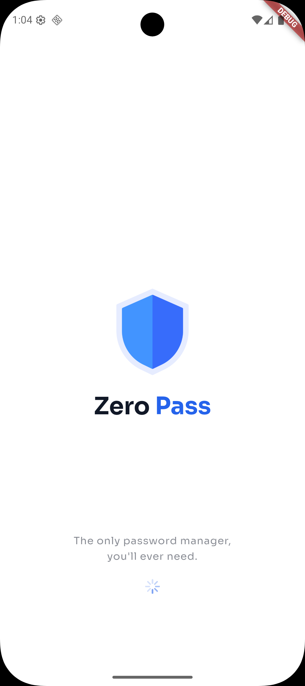
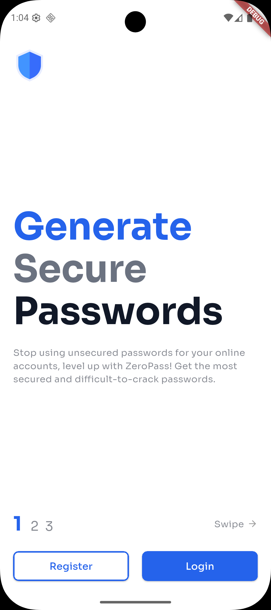
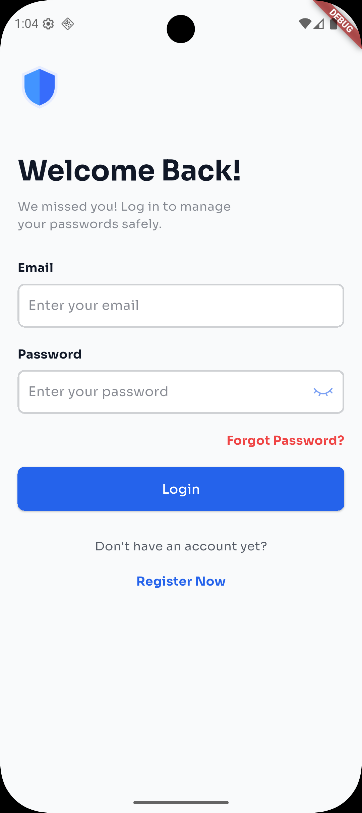
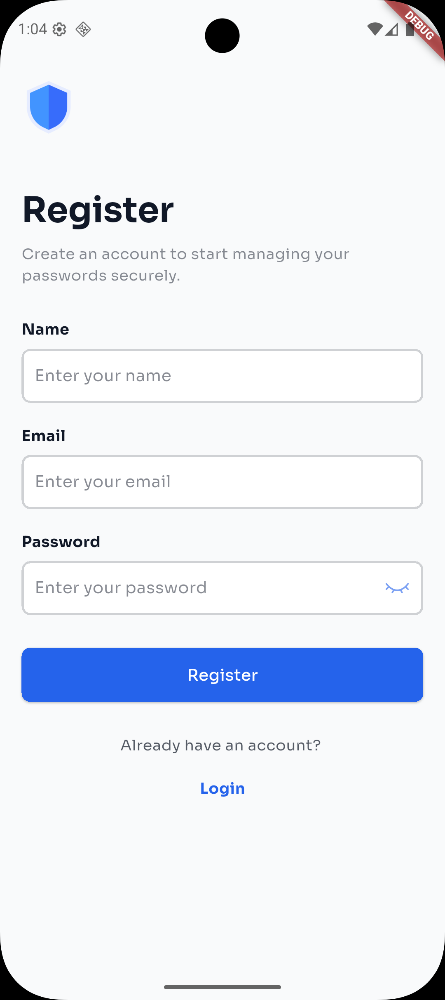
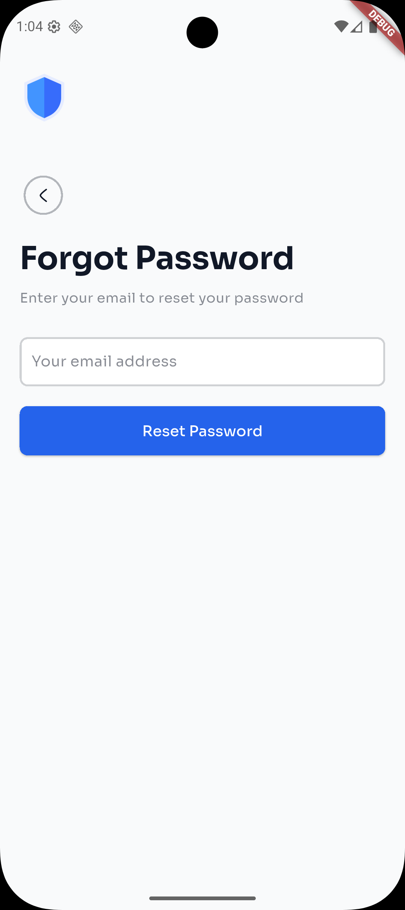

# ZeroPass

A modern, secure, and user-friendly password manager built with Flutter.

## Overview

**ZeroPass** is a cross-platform password manager that prioritizes user privacy and data security. With end-to-end encryption, seamless sync, and a beautiful interface, ZeroPass helps you generate, store, and manage strong passwords for all your accounts—anywhere, anytime.

Built with Flutter 3.8.1+ and modern development practices, ZeroPass offers a robust solution for password management across Android, iOS, Windows, macOS, Linux, and Web platforms.

---

## ✨ Features

- **End-to-End Encryption:** Your passwords are encrypted locally before they ever leave your device using industry-standard crypto and encrypt packages.
- **Secure Storage:** Uses `flutter_secure_storage` and `hive` for encrypted local storage of sensitive data.
- **Password Generator:** Instantly create strong, unique passwords for every account with customizable criteria.
- **Cross-Platform Sync:** Access your passwords on mobile and desktop with seamless synchronization powered by Supabase.
- **Organize & Categorize:** Easily manage and categorize your logins for quick access and better organization.
- **Modern UI:** Clean, intuitive design with custom Sora and Space Grotesk fonts and smooth navigation.
- **Account Management:** Secure authentication with registration, login, and password recovery flows.
- **Clipboard Integration:** Quick copy-to-clipboard functionality for passwords and usernames.
- **State Management:** Efficient state management using Provider pattern for reactive UI updates.

---

## 📸 App Screenshots

Below are some screenshots of ZeroPass in action:

<p align="center">
  
  
  
  
  
</p>

---

## 🚀 Getting Started

### Prerequisites
- [Flutter SDK](https://flutter.dev/docs/get-started/install) (3.8.1 or higher)
- [Dart SDK](https://dart.dev/get-dart) (included with Flutter)
- A [Supabase](https://supabase.com/) project (for sync features)

### Installation

1. **Clone the repository:**
   ```bash
   git clone https://github.com/kaiumallimon/zeropass.git
   cd zeropass
   ```

2. **Install dependencies:**
   ```bash
   flutter pub get
   ```

3. **Set up environment variables:**
   - Create a `.env` file in the root directory
   - Add your Supabase credentials:
     ```env
     SUPABASE_URL=your_supabase_url_here
     SUPABASE_ANON_KEY=your_supabase_anon_key_here
     ```

4. **Generate necessary files (if needed):**
   ```bash
   flutter packages pub run build_runner build
   ```

5. **Run the app:**
   ```bash
   flutter run
   ```

---

## 📁 Project Structure

```
lib/
├── core/           # App-wide constants and themes
├── data/           # Data models, storage, and sync logic
│   ├── local_db/   # Local database services
│   ├── models/     # Data models
│   └── services/   # External services integration
├── presentation/   # UI pages and widgets
│   ├── pages/      # App screens and pages
│   └── providers/  # State management providers
├── routes/         # App navigation
├── shared/         # Reusable widgets
└── utils/          # Utility functions
```

```
assets/
├── fonts/          # Custom fonts (Sora, Space Grotesk)
├── images/         # Image assets
└── svgs/           # SVG icons
```

---

## 🛡️ Security
- All sensitive data is encrypted using the `encrypt`, `crypto`, and `pointycastle` packages.
- Local storage uses `flutter_secure_storage` and `hive` for maximum security.
- No passwords are ever stored or transmitted in plain text.
- Authentication flows use PKCE (Proof Key for Code Exchange) for enhanced security.

---

## 📦 Dependencies

### Core Dependencies
- [Flutter](https://flutter.dev/) - UI toolkit
- [Supabase Flutter](https://pub.dev/packages/supabase_flutter) - Backend services and sync
- [Provider](https://pub.dev/packages/provider) - State management
- [Go Router](https://pub.dev/packages/go_router) - Navigation

### Security & Storage
- [Flutter Secure Storage](https://pub.dev/packages/flutter_secure_storage) - Secure local storage
- [Hive](https://pub.dev/packages/hive) - NoSQL database
- [Encrypt](https://pub.dev/packages/encrypt) - Encryption utilities
- [Crypto](https://pub.dev/packages/crypto) - Cryptographic functions
- [PointyCastle](https://pub.dev/packages/pointycastle) - Advanced cryptography

### UI & User Experience
- [HugeIcons](https://pub.dev/packages/hugeicons) - Icon library
- [QuickAlert](https://pub.dev/packages/quickalert) - Alert dialogs
- [Clipboard](https://pub.dev/packages/clipboard) - Clipboard operations

### Utilities
- [Flutter DotEnv](https://pub.dev/packages/flutter_dotenv) - Environment variables
- [HTTP](https://pub.dev/packages/http) - HTTP client
- [UUID](https://pub.dev/packages/uuid) - UUID generation
- [Path Provider](https://pub.dev/packages/path_provider) - File system paths

### Development Dependencies
- [Flutter Lints](https://pub.dev/packages/flutter_lints) - Linting rules
- [Hive Generator](https://pub.dev/packages/hive_generator) - Code generation
- [Build Runner](https://pub.dev/packages/build_runner) - Build system

---

## 🖋️ Customization
- Custom fonts: Sora, Space Grotesk (see `pubspec.yaml`)
- Easily swap themes or add dark mode in `lib/core/theme/app_theme.dart`

---

## 🤝 Contributing

Contributions are welcome! Please open issues or submit pull requests for new features, bug fixes, or improvements.

1. Fork the repo
2. Create your feature branch (`git checkout -b feature/YourFeature`)
3. Commit your changes (`git commit -am 'Add new feature'`)
4. Push to the branch (`git push origin feature/YourFeature`)
5. Open a Pull Request

---

## 📄 License

This project is licensed under the MIT License.

---

## 🙏 Acknowledgements
- [Flutter](https://flutter.dev/)
- [Supabase](https://supabase.com/)
- [Open Source Community](https://github.com/)
